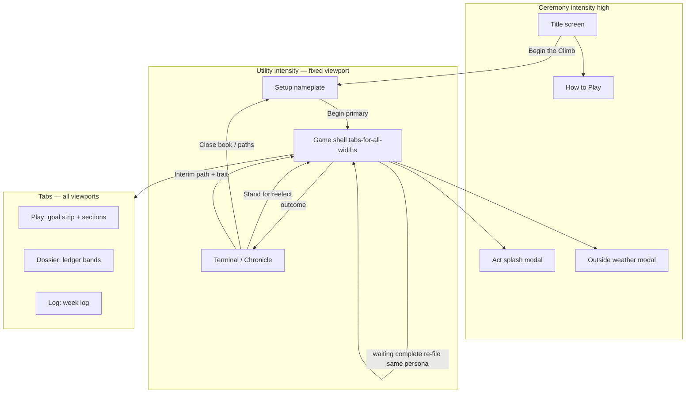
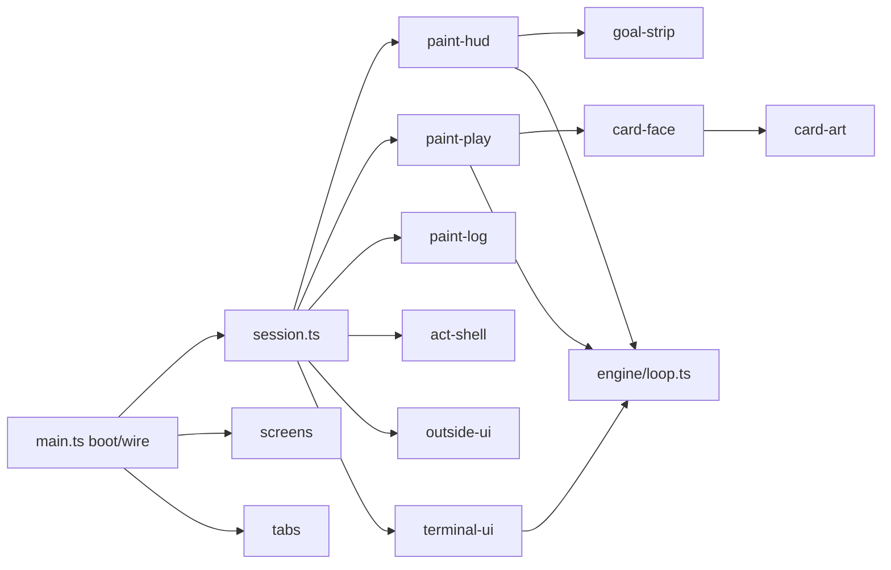

# UI + Gameplay Flow Redesign — Candidate Zero

| Field | Value |
|-------|--------|
| **Title** | UI + Gameplay Flow Redesign |
| **Author** | (design / agent draft) |
| **Date** | 2026-07-23 |
| **Status** | Draft (rev 3) · **PR-1…PR-7 landed** (optional PR-8 deferred) |
| **Package** | 0.1.0 |
| **Surface** | Vite web UI (Unity **on hold** — out of critical path) |
| **Live alpha** | https://poseyatx.github.io/candidate-zero/ |
| **Related** | `docs/UI-IA.md`, `docs/GAME-FLOW.md`, `docs/CARD-TAXONOMY.md`, `docs/CARD-ART-STATUS.md`, `docs/RESTING.md` |

> **Doc hygiene (PR-7 done):** Prefer **live code**. `docs/UI-IA.md` now states current bands + goal strip + module tree; pre-Phase-6 diagnosis is archived as historical only. `docs/CARD-ART-STATUS.md`: `CARD_ART` lives in `src/ui/card-face.ts` (empty until rasters); emblems in `card-art.ts`; gate `check:card-art`.

---

## Overview

Candidate Zero is a playable Texas Legislature roguelike deckbuilder with a pure TypeScript engine and a Vite presentation shell. Package **0.1.0** ships a full harness-green engine, ~116 presentation cards, Phase 6 ledger hierarchy, **tabs-for-all-widths** in-run shell, act ceremony shells, Outside weather, and Chronicle/Waiting persistence. The product surface that players actually touch—**in-run play clarity, card faces, and one-handed flow**—still feels unfinished, spreadsheet-adjacent, and brittle for agents to maintain.

This design proposes an **incremental, presentation-only** redesign that (1) makes stage goals and next actions always readable via a frozen **GoalStrip** data model, (2) finishes information hierarchy on the play surface (not only the dossier), (3) freezes a disciplined **card face system** where engraved emblems are primary and raster art is optional, layout-safe, and CI-gated, (4) tightens tab flow and truthfulness (ground picker, draft, session/waiting decision trees) without inventing a fourth rules engine, and (5) **fully extracts** the ~1462-line `src/ui/main.ts` mega-file through a multi-PR module map so future sessions stop regressing features (PR #27 restore cycle). Unity remains documented for later hosts; Vite is the product.

---

## Background & Motivation

### Current architecture (verified)

| Layer | Path | Role |
|-------|------|------|
| Data | `src/data/` | Cards, setup, Outside, signatures, starmap |
| Engine | `src/engine/` | Pure rules; `loop.ts` Campaign session |
| Host API | `src/engine/api.ts` v1.0.0 | Frozen binding for Unity/other hosts later |
| UI | `src/ui/main.ts` (1462 lines), `styles.css` (1685), `card-art.ts` (180), `index.html` | Presentation only |
| Gates | `npm run harness`, `smoke:ui`, `a11y` | Must stay green per PR |

**Dual-path risk today:** the Vite UI drives `Campaign` / `loop.ts` **directly** (`createCampaign`, `playFromHand`, `endWeekInPlace`, …). The host API is the correct long-term boundary but is not what the live UI uses. This redesign does **not** require a full API migration or an early `engine-bridge` to improve UX; it does require any new UI module to keep odds/resolve out of presentation.

### Shipping in-run shell (CSS truth — not aspirational)

Verified in `styles.css` mobile layer (not viewport-gated for the game shell):

| Rule | Behavior **all widths** |
|------|-------------------------|
| `#game:not(.hidden)` | `position: fixed; inset: 0; height: 100dvh` — full-viewport game shell |
| `.mtab-panel` | only `.active` is `display: block` — **tabs hide non-active panels everywhere** |
| `#game #hud` | `display: flex` — HUD forced on in-game (overrides base `.hud { display: none }` and the `@media (max-width: 800px)` rule when inside `#game`) |
| `.mbottom-nav` | always shown while in game |
| `.ledger-vitals` | still rendered into `#ledger` (Dossier tab), not a side-by-side desktop path |

**There is no side-by-side Play + Dossier desktop layout today.** Base `@media` HUD rules are superseded by the in-game fixed shell. Desktop polish = density/type/column count on the same tab IA — not a dual layout.

### What Phase 6 already fixed (do not re-litigate)

From `docs/UI-IA.md` **Done when** checklist + live `renderLedger()`:

- Ledger dossier bands: Identity first → Force/Chamber/Waiting bank → Vitals → Machine
- Fixed toast stack (`#toast-host`) so juice does not thrash the card grid
- Reserved `#week-hint` height
- Setup nameplate continuity; sticky HUD + persona chip
- Stage-conditional chrome (force vs session bill vs waiting bank)

### What still hurts (owner + code truth)

1. **Gameplay flow clarity** — Act shells and `#week-hint` exist, but there is no structured goal/progress/next model tied to decision trees (ballot doors, GOTV, bill pipeline stages, waiting bank).
2. **Information hierarchy on the play surface** — Dossier is banded; Play is “kit hint + hand + camp + shop” in a flat grid. **Current emit order** (primary/general): kit hint → **hand** → **camp** → shop — not camp-first.
3. **Card presentation** — Strong anatomy in `cardInner`; `CARD_EMBLEM` has only **24** PL* keys; SS/WA/MV/SIG/BUY fall back to star. **No `CARD_ART` map in code** (CARD-ART-STATUS is stale). Raster Block Walk PNG was reverted.
4. **One-handed / all-width tab flow** — Three tabs always; modals and draft can strand orientation; shop discovery weak when AP=0.
5. **Ceremony vs utility** — Title ceremony → fixed-viewport utility; act splash bridges; day-to-day still sparse on “what now.”
6. **Truthfulness gaps** — Ground picker title still says opp “does not affect odds yet” while `GAME-FLOW.md` + field math tax rivalRap; tutorial lists “Three Acts” and omits Act IV Waiting.
7. **Agent-maintainability** — Mega-file; PR #27 class regressions.

### Player loop (engine truth — presentation must mirror)

```
Title → Setup (nameplate) → Act I Primary (ballot by W8)
  → Act II General (GOTV) → Act III Session (bill pipeline)
  → terminal / Chronicle paths → Act IV Waiting → re-file same persona
```

Residency (`CARD-RESIDENCY.md`): Outside never hand. Taxonomy: risk ≠ kind; descriptions off-face.

---

## Goals & Non-Goals

### Goals

1. **Always-on orientation** — Act, week goal, progress, next move readable from Play without Dossier.
2. **Play-surface hierarchy** — Goal strip + sectioned playables; Phase 6 dossier bands unchanged.
3. **Disciplined card face** — Fixed zones; emblem primary; optional art CI-gated and layout-safe.
4. **Tabs-for-all-widths excellence** — Same IA desktop/mobile; density polish only; shop discoverable.
5. **Ceremony continuity** — Shared materials; shorter splash bodies; no empty polish.
6. **Full module extract** — Target tree landed across extract PRs; `main.ts` ≤ ~300 lines boot/wire + session ref; no circular paint imports.
7. **End-to-end flow truth** — Draft, session pipeline matrix, waiting/re-file, ground-picker copy, tutorial Act IV.
8. **Incremental ship** — Ordered serial PRs on shared files; each harness/`smoke:ui`/`a11y` green; no Unity critical path.

### Non-Goals

- Unity rewrite or editor vertical slice (**on hold**).
- Reimplementing odds/resolve/yields/calendar in UI.
- Changing engine balance, residency, or `trap` as player stamp.
- Full raster art pipeline or huge PNGs.
- Inventing new engine stats for chrome.
- Wholesale typeface system rewrite.
- Migrating Vite UI onto `engine/api.ts` in this redesign (deferred RFC).
- **Reintroducing dual desktop/mobile layout** that forks tab IA.

---

## Key Decisions

| # | Decision | Rationale |
|---|----------|-----------|
| **K1** | **Vite-first product surface**; Unity later host only. | Unity on hold; live alpha is Pages. |
| **K2** | **Goal strip reads live `GameState`** (same as HUD) + pure presentation helpers; **does not require** extending `LedgerSnapshot`. No new engine stats. | `LedgerSnapshot` has no `gotv` / `sigNeed` / bill; HUD already uses `state.sigNeed`, persona, stage. GOTV = `state.groundsArr.reduce((s,g)=>s+(g.gotv\|\|0),0)` (same as `feedback.totalGotv`). |
| **K3** | **Card face: emblem-first, art optional** in fixed `.card-art` plate; ≤~300px / ≤50KB assets; CI size gate before any sample art; URLs via **K15** `BASE_URL`. | Block Walk lesson; no in-UI `CARD_ART` map shipping; anvil-port is optional groundwork only. |
| **K4** | **Descriptions stay off-face** (title + aria; optional inspect later). | a11y law; axe CI. |
| **K5** | **Three tabs for all viewport widths** (Play / Dossier / Log); bottom nav always in-game; shop on Play with sectioning — not a fourth tab. | Matches shipping CSS; dual layout re-breaks one-handed IA. |
| **K6** | **Two overlay policies, not one stack:** (1) **End-week ceremony queue:** Outside → Act splash (→ waiting splash if any); (2) **In-week:** ground picker exclusive bottom sheet; draft exclusive panel (not a modal); toasts non-blocking. | Matches `endWeek` `afterWeather`; ground picker z=100 is during-play, not ceremony. |
| **K7** | **Full module extract via PR-1 / PR-1b / PR-1c** before or interleaved with visual work; success = tree landed + `main.ts` ≤~300. | PR-1 leaves alone cannot hit line budget. |
| **K8** | **Keep direct `loop.ts` imports** in extract PRs. **`engine-bridge.ts` deferred** to a post-extract hygiene PR (re-export only, no logic). | Façade mid-extract adds merge risk without player value. |
| **K9** | **`GOAL_COPY` + `GoalStripInput` are frozen tables** in `goal-strip.ts` — full matrices below, not free-form paint strings. | Determinism + smoke. |
| **K10** | **Play section order (intentional change):** Draft (blocking) · **Camp** · **Hand** · Shop for primary/general. Today is Hand → Camp → Shop; reordering Camp above Hand is deliberate UX (ballot doors before deck noise). Session/waiting use kit section models (below). | Scan path: doors first when not on ballot. |
| **K11** | **Ship straight to alpha**; **no** `?flow=v2` flag by default. Revert by git. Optional flag only if a single PR is owner-controversial. | Small audience; flags leave dead CSS. |
| **K12** | **Emblem reuse rule:** unique preferred for main-deck PL*; **prefix defaults** for kits (SS→gavel, WA→hourglass, MV→map/network, SIG→star-seal variant, BUY→coin). Unmapped → star fallback remains safe. | 116 cards; 24 mapped today; unique SVG for all is out of scope. |
| **K13** | **Serial ownership of `main.ts` / `styles.css`:** no two open PRs edit shared regions of those files without rebase contract. Prefer serial PR-1→1b→1c→2→3→**3.5 (card zone CSS)**→4. **PR-4 default does not touch `styles.css`.** | Prevents agent merge chaos; closes soft “coordinate styles” loophole. |
| **K14** | **No paint/outside/terminal/act-shell → `session.ts` imports.** Mutable campaign lives in `session.ts` (or `main` until extract); orchestrators pass `Campaign` / `GameState` **as arguments**. `getCampaign()` is forbidden in leaf modules. | Avoids circular TS/Vite graphs that break agent extracts. |
| **K15** | **Card art URLs always use `import.meta.env.BASE_URL`.** Vite ships with `base: '/candidate-zero/'` (Pages). Allowlist validates resolved URL under `BASE_URL + 'assets/cards/'`, no `..`, no `http(s):`. | Absolute `/assets/cards/…` 404s on alpha; bare allowlist rejected correct `/candidate-zero/…` paths. |

---

## Proposed Design

### 1. Screen map (product IA — all widths)



| Surface | DOM / code | Job |
|---------|------------|-----|
| Title | `#title` | Ceremony entry |
| Tutorial | `#tutorial` | Rules literacy (must include Act IV) |
| Setup | `#setup` | Nameplate + Chronicle |
| Game | `#game` fixed | HUD + act banner + goal strip + tabs + End Week + bottom nav |
| Terminal | `#terminal` | Epithet, paths, reelect, rest |
| Act splash | `#act-splash` | Stage handoff (ceremony queue) |
| Outside | `#outside-weather` | World event; never hand |
| Ground picker | `#ground-picker` | In-week field ground choice |
| Draft | `#draft` panel | Phase draft exclusive (not modal) |
| Toasts | `#toast-host` | Non-blocking juice |

### 2. Player flow (orientation model)

```mermaid
sequenceDiagram
  participant P as Player
  participant UI as Vite UI
  participant E as Engine loop.ts

  P->>UI: Begin primary
  UI->>E: createCampaign + startWeek
  UI->>UI: openActSplash(primary)
  UI->>UI: paint HUD + GoalStrip + sections

  loop Each week
    alt pendingDraft
      UI->>UI: draft exclusive; hide hand playables
      P->>UI: pick draft option
      UI->>E: pickPhaseDraft
    else play
      P->>UI: Camp / Hand / Shop
      opt field card
        UI->>UI: ground picker (in-week overlay)
      end
      UI->>E: playFromHand
      UI->>UI: toast + paint
    end
    P->>UI: End week
    UI->>E: endWeekInPlace
    alt pendingOutside
      UI->>UI: Outside then Act splash if transition
    else enter_general / enter_session / waiting
      UI->>UI: Act splash
    else over
      UI->>UI: enterTerminal
    end
  end
```

### 3. In-run chrome (target furniture — all widths)

```
┌──────────────────────────────────────────────┐
│ HUD (always in-game) act · AP · $ · W · gate │
├──────────────────────────────────────────────┤
│ Act banner                                   │
├──────────────────────────────────────────────┤
│ #goal-strip (reserved min-height)            │
│   .goal-primary / .goal-progress / .goal-next│
├──────────────────────────────────────────────┤
│ Active tab only                              │
│  PLAY | DOSSIER | LOG                        │
├──────────────────────────────────────────────┤
│ End week (Play tab) · bottom nav (always)    │
└──────────────────────────────────────────────┘
```

Wide screens: more card columns (`@media min-width: 560px` already 3-col); **same tabs**. Do not reintroduce dual dossier+play.

---

### 3a. Goal strip — data model (frozen)

#### DOM contract (`index.html`)

Replace or promote `#week-hint` to:

```html
<div id="goal-strip" class="goal-strip" aria-live="polite">
  <div class="goal-primary"></div>
  <div class="goal-progress"></div>
  <div class="goal-next"></div>
</div>
```

CSS: fixed `min-height` (≈ 3 lines at 0.85rem + padding) so text swaps never thrash the card grid (UI-IA toast law). On 320px, allow wrap **inside** the reserved box; do not collapse to zero height when empty — use `\u00a0` or stage fallback.

Smoke: after seed `4242` week 1, `#goal-strip` exists and text matches `/ballot|sig|Petition|Fee/i`.

#### `GoalStripInput` (presentation view — built in paint from `GameState`)

```ts
// src/ui/goal-strip.ts
export interface GoalStripInput {
  stage: 'primary' | 'general' | 'session' | 'waiting';
  over: boolean;
  outcome?: string;
  pendingDraft: boolean;
  week: number;
  weeksTotal: number;
  stageWeek: number;       // stageWeek(state)
  ap: number;
  fieldAp: number;
  // Primary / ballot
  ballot: boolean;
  signatures: number;
  sigNeed: number;         // state.sigNeed — NOT on LedgerSnapshot
  contacts: number;
  nameID: number;
  // General
  totalGotv: number;       // sum groundsArr[].gotv
  // Session
  billPipelineStage: number | null; // bill?.pipelineStage ?? null
  billStatus: string | null;
  billHeat: number;
  speakerFreeze: number;   // Number(sessionFlags?.speakerFreeze || 0)
  districtStanding: number;
  // Waiting
  waitingPathId: string | null;
  bankContacts: number;    // sessionFlags waitBankContacts
  bankName: number;
  waitingWeeks: number;    // WAITING_WEEKS
  // Economy cues for next-line
  money: number;
  availableCash: number;
  shopAvailable: boolean;  // any BUY* playable
  campPetitionVisible: boolean;
  campFeeVisible: boolean;
}
```

**Builder** (paint/hud module — presentation only):

```ts
function totalGotv(state: GameState): number {
  return state.groundsArr.reduce((s, g) => s + (g.gotv || 0), 0);
}

export function buildGoalStripInput(state: GameState, opts: {
  shopAvailable: boolean;
  campPetitionVisible: boolean;
  campFeeVisible: boolean;
}): GoalStripInput {
  const bank = state.sessionFlags || {};
  return {
    stage: state.stage as GoalStripInput['stage'],
    over: !!state.over,
    outcome: state.outcome,
    pendingDraft: !!(state.pendingDraft?.options?.length),
    week: state.week,
    weeksTotal: state.weeksTotal,
    stageWeek: stageWeek(state),
    ap: state.ap,
    fieldAp: state.fieldAp,
    ballot: state.ballot,
    signatures: state.signatures,
    sigNeed: state.sigNeed,
    contacts: state.contacts,
    nameID: state.nameID,
    totalGotv: totalGotv(state),
    billPipelineStage: state.bill ? state.bill.pipelineStage : null,
    billStatus: state.bill?.status ?? null,
    billHeat: state.bill?.heat ?? 0,
    speakerFreeze: Number(state.sessionFlags?.speakerFreeze || 0),
    districtStanding: state.districtStanding,
    waitingPathId: state.waitingPathId ?? null,
    bankContacts: Number(bank.waitBankContacts || 0),
    bankName: Number(bank.waitBankName || 0),
    waitingWeeks: WAITING_WEEKS,
    money: state.money,
    availableCash: snapshot(state).availableCash,
    ...opts
  };
}
```

**Do not extend `LedgerSnapshot` in this redesign** unless host parity later needs it. Prefer live state (HUD pattern).

#### Full `GOAL_COPY` matrices

Keys select rows; live numbers interpolate into progress/next.

| Key | `.goal-primary` | `.goal-progress` template | `.goal-next` template |
|-----|-----------------|---------------------------|------------------------|
| `over` | Campaign over | `{outcome}` | Start a new run from the masthead |
| `draft` | Phase draft | Pick one card for your pool | Resolve draft before End Week |
| `primary_pre_ballot` | Make the ballot by end of week 8 | `{signatures}/{sigNeed} sigs · W{stageWeek}/8` | Petition · Filing Fee · or raise cash for the fee |
| `primary_pre_ballot_ap0` | Make the ballot by end of week 8 | `{signatures}/{sigNeed} sigs · W{stageWeek}/8` | Shop (0 AP) still open · or End Week |
| `primary_on_ballot` | Survive the primary | Contacts {contacts} · Name {nameID} · W{stageWeek}/8 | Field · chairs · force · shop |
| `primary_on_ballot_ap0` | Survive the primary | Contacts {contacts} · Name {nameID} · W{stageWeek}/8 | Shop (0 AP) still open · or End Week |
| `general` | Win November — bank GOTV | GOTV {totalGotv} · W{stageWeek}/6 · cal W{week}/{weeksTotal} | Field → turnout · GOTV Weekend · contrast |
| `general_ap0` | Win November — bank GOTV | GOTV {totalGotv} · W{stageWeek}/6 | Shop if open · or End Week |
| `session_unfiled` | File your signature bill | Bill unfiled · W{week}/{weeksTotal} sine die | File the Bill (pipeline) · casework holds the seat |
| `session_pipeline` | Advance the bill · hold the seat | {billLabel} · heat {billHeat} · W{week}/{weeksTotal} | One pipeline motion this week · or casework |
| `session_calendar` | Get to the floor before sine die | {billLabel} · heat {billHeat} | Calendar / floor motions · watch Speaker freeze |
| `session_freeze` | Leadership freeze is biting | Freeze {speakerFreeze} · {billLabel} | Errands / favor · casework · wait out freeze |
| `session_ap0` | End the legislative week | {billLabel} | End Week — free motions only if any remain |
| `waiting` | Bank for the next filing | Path {path} · +{bankContacts} contacts · +{bankName} name · W{week}/{waitingWeeks} | One AP · WA kit · then re-file same persona |

**Deleted / not used:** `waiting_done_pending` — waiting completion is handled by engine `finishWaiting` + `continueAfterWaiting` then **Act I splash** + `primary_*` goal strip. No intermediate chrome frame; do not ship a dead GOAL_COPY row.

**Bill labels:** reuse `billStageLabelUi` (Unfiled…SIGNED / Dead).

**Selection logic (pseudocode):**

```
if over → over
else if pendingDraft → draft
else if waiting → waiting
else if session:
  if ap exhausted → session_ap0
  else if speakerFreeze > 0 && bill needs calendar/floor → session_freeze
  else if pipelineStage == 0 or no bill → session_unfiled
  else if pipelineStage >= 5 → session_calendar
  else → session_pipeline
else if general:
  if ap exhausted → general_ap0 else general
else: // primary
  if !ballot:
    if ap exhausted → primary_pre_ballot_ap0 else primary_pre_ballot
  else:
    if ap exhausted → primary_on_ballot_ap0 else primary_on_ballot
```

---

### 3b. Player decision trees (per stage)

Feeds `.goal-next` and Play section emphasis.

#### Primary

| If you see… | Do… |
|-------------|-----|
| Not on ballot, weeks left | Petition (labor) and/or Filing Fee (money); camp section first |
| Fee unaffordable | Field / fish fry / shop to raise `$`; Self-Fund is a debt bargain |
| On ballot | Force (contacts, name, chairs); shop 0 AP |
| AP = 0 (any primary) | Shop or End Week (`primary_*_ap0` keys) |
| Phase draft | Pick one — blocks End Week |
| Field card | Ground picker; contested turf taxes odds (see §6b) |

#### General

| If… | Do… |
|-----|-----|
| Need turnout | Field banks GOTV; PL19 GOTV Weekend; rapport seeds convert |
| Kitchen-table / club math | Closed — don’t hunt PL08 |
| Flatbed asset | Rides (PL23) unlock path |
| AP = 0 | End Week (shop if any) |

#### Session

| Bill / seat state | Next |
|-------------------|------|
| No bill / stage 0 | File the Bill |
| Filed → referred → heard → voted | One **pipeline** motion/week (SS seek referral, chair, testimony, …) |
| Calendar / floor | Calendar slot, floor fight; **speaker freeze** blocks when favor low |
| District soft / casework teeth | District Casework (SS08) — seat bleed if neglected |
| PAC claim (OB1) | Referral collects — expect district hit |
| Sine die approaching | Push law or survive seat; terminal choices after |

#### Waiting → re-file

| Step | UI furniture |
|------|----------------|
| Terminal loss/session rest path | Chronicle path cards + trait (existing terminal UI) |
| Enter waiting | Act IV splash; stage chrome waiting; goal strip bank meters |
| Each week | WA* kit section; 1 AP; End interim week |
| Waiting complete | Engine `finishWaiting` + `continueAfterWaiting` — **same persona**, no setup form; Act I splash with banked text; goal strip primary_pre_ballot |

#### Draft UX (PR-2/PR-3)

- When `pendingDraft`: goal strip key `draft`; `#draft` visible above sections; `#playables` shows only “Resolve the phase draft first” (already); auto-scroll `#draft` into view; focus first draft card.
- Empty hand during draft is OK — do not flash camp/shop under draft exclusive message.
- After pick: paint restores Camp/Hand/Shop order.

---

### 4. Card face system

#### Anatomy (frozen zones)

```
┌─────────────────────────┐
│ [kind seal]      name   │  escapeHtml(name); 2-line clamp
│ ──────── ◆ ────────     │
│ ┌─────────────────────┐ │
│ │   EMBLEM / ART SLOT │ │  fixed ~28–32% height; contain
│ │   (cost seal ↗)     │ │
│ └─────────────────────┘ │
│ cost-subs · tagline     │
│ risk · p≈NN% · meter    │
└─────────────────────────┘
```

#### Art policy + CI gate

| Layer | Spec |
|-------|------|
| Default | `emblemFor(id)` — prefix fallback then star |
| Optional raster | File on disk: `public/assets/cards/{id}.…`; **public URL** always `` `${import.meta.env.BASE_URL}assets/cards/${file}` `` (Vite `base: '/candidate-zero/'` → `/candidate-zero/assets/cards/…` on Pages) |
| Map | Store **filename only** (e.g. `PL01.webp`) or relative `assets/cards/…` **without** leading site base; helpers prepend `BASE_URL`. Do **not** hardcode `/assets/cards/` absolutes. |
| Size | ≤ 300px max dimension; **≤ 50KB** per file |
| Layout | `width`/`height` attrs + CSS `object-fit: contain` on plate; never full-bleed product photo |
| Forbidden | Remote `http(s):` URLs; `..` path segments; layout depending on intrinsic size; assets without CI green |
| Gate (PR-4) | `npm run check:card-art` — see script contract below |
| Ship rule | **No sample raster art lands until the gate script is wired** |

**Anvil-port groundwork (partial, out of UI critical path):** `src/lib/anvil-port/cardAssets.ts` already sketches greybox fallback + `CARD_ART_PATH` relative paths and plate HTML. Treat as **optional PR-4 input** (greybox + resolve pattern), not product scope rewrite. **Bug to fix when wiring:** `resolveCardArt` currently builds `url: '/' + rel`, which **ignores `BASE_URL`** and will 404 on Pages the same way a naïve allowlist does — any adopt path must switch to `import.meta.env.BASE_URL + rel`.

**`check:card-art` script contract (`scripts/check-card-art.mjs`):**

```
DIR = public/assets/cards
if DIR does not exist → exit 0 (OK; no assets yet)
if DIR exists:
  fail if any file size > 50KB
  optionally fail on non-image extensions outside {png,webp,jpg,svg}
exit 0
```

Do **not** create `public/assets/cards/.gitkeep` until the gate script exists and is in `package.json`. Naïve `find …` that errors on missing dir is a **bug** in the gate.

#### `card-face` API (not a pure leaf without state)

`cardInner` today closes over `campaign!.state` for odds. Extract must take explicit inputs:

```ts
// src/ui/card-face.ts
export interface CardFaceView {
  /** Precomputed display odds 0.02–0.95, or undefined if no odds fn */
  p?: number;
}

export function computeCardFaceView(state: GameState, card: PlayCard): CardFaceView {
  const g = pickDefaultGround(state);
  const base = card.odds?.(state, g);
  const mod = cardAttrMod(state, card);
  const p = base !== undefined ? Math.max(0.02, Math.min(0.95, base + mod)) : undefined;
  return { p };
}

export function cardInner(
  card: PlayCard,
  opts: { camp?: boolean; shop?: boolean; locked?: boolean; lockReason?: string },
  view: CardFaceView
): string { /* use view.p; escapeHtml(card.n); attrEscape on title paths */ }

export function cardHtml(
  card: PlayCard,
  index: number,
  opts: /* … */,
  view: CardFaceView
): string { /* aria-label uses attrEscape(card.d) as today */ }

/** Filename or repo-relative assets/cards/… — never a remote URL. */
export type CardArtEntry = { file: string };

/** Optional map: cardId → file under public/assets/cards/ */
export const CARD_ART: Record<string, CardArtEntry> = {
  // empty until gate green + real assets
};

/** Build browser URL with Vite base (Pages: /candidate-zero/). */
export function cardArtUrl(file: string): string {
  const base = import.meta.env.BASE_URL; // e.g. '/candidate-zero/'
  const cleaned = file.replace(/^\/+/, '').replace(/^assets\/cards\//, '');
  if (cleaned.includes('..') || cleaned.includes('://')) return '';
  return `${base}assets/cards/${cleaned}`;
}

export function isSafeCardArtUrl(url: string): boolean {
  if (!url || /^(https?:)?\/\//i.test(url) || url.includes('..')) return false;
  const base = import.meta.env.BASE_URL;
  const prefix = `${base}assets/cards/`;
  return url.startsWith(prefix);
}

export function artPlateHtml(cardId: string): string {
  const entry = CARD_ART[cardId];
  if (!entry?.file) {
    return `<span class="card-art">${emblemFor(cardId)}</span>`;
  }
  const url = cardArtUrl(entry.file);
  if (!isSafeCardArtUrl(url)) {
    return `<span class="card-art">${emblemFor(cardId)}</span>`;
  }
  const src = attrEscape(url);
  return `<span class="card-art has-raster"></span>`;
}
```

**Unit/smoke for helper:** assert `cardArtUrl('PL01.webp')` with `BASE_URL='/candidate-zero/'` equals `/candidate-zero/assets/cards/PL01.webp`; reject `https://evil/x.png` and `../etc/passwd`.

- Odds computation stays in paint via **engine helpers** (`pickDefaultGround`, `cardAttrMod`, `card.odds`) — UI must not recompute SAFE/STD/VOL bands.
- **Escape mandate:** `escapeHtml` on `card.n`, tagline, lockReason text nodes; `attrEscape` on title/aria/src. Fix pre-existing unescaped `card.n` during extract if cheap (acceptance for PR-1).

#### Emblem coverage (PR-4 accept)

| Scope | Policy |
|-------|--------|
| Existing 24 PL* | Keep unique where iconic |
| SS01–SS13 (+ SS_PAC) | Default emblem key `gavel` (add SVG) unless per-id override |
| WA01–WA09 | Default `hourglass` |
| MV01–MV14 | Default `network` / map-pin silhouette |
| SIG* | Default `seal` (persona seal variant) |
| BUY* | Default `coin` (already exists) |
| Unmapped | star (current `emblemFor` fallback) |

Acceptance: every visible catalog id resolves without throw; **kit prefixes non-star** after PR-4; no layout overflow at 320px.

---

### 5. Play tab sectioning

#### Primary / general (intentional reorder)

**Today:** hint → hand → camp → shop.  
**Target:** 

1. **Draft** (if pending) — exclusive  
2. **Camp / ballot doors** — Petition, Fee (`index < 0`, not BUY)  
3. **Hand** — deck plays  
4. **Shop** — BUY* with section label  

**Rationale:** When not on ballot, doors are the win condition; burying them under hand cards teaches the wrong scan path. Muscle-memory change is acknowledged for live alpha.

HTML:

```html
<section class="play-section" data-section="camp">
  <h3 class="play-section-label">Ballot doors</h3>
  …cards…
</section>
```

#### Session

| Section | Contents |
|---------|----------|
| `pipeline` | SS motions that advance bill (when legal) |
| `chamber` | Free/casework/errand motions (SS08, etc.) |
| (no shop/camp) | Early-return path today; keep — labeled kit, not primary sections |

If hard split by card id is ambiguous in v1, single section **Legislative motions** with subtitle from `ACT_SHELLS.session.kitLabel` is acceptable; prefer two labels when `listPlayableHand` can partition by pipeline flag or known ids.

#### Waiting

| Section | Contents |
|---------|----------|
| `orbit` | WA* path kit only; label includes `waitingPathId` |

#### PR-3 accept

- Primary: Camp section DOM before Hand section  
- Session: labeled kit (not empty unlabeled grid)  
- Draft exclusive; End Week still blocked when draft pending (engine + UI hint)  
- Shop section when BUY* present; visible at AP=0  

---

### 6. Overlay policies (not one modal stack)

#### A. End-week ceremony queue

Code today (`endWeek`): weather first, then `enter_general` / `enter_session` splash in `afterWeather`.

| Step | Overlay | Notes |
|------|---------|-------|
| 1 | Outside weather | if `pendingOutside` |
| 2 | Act splash | if transition; waiting complete uses primary splash + banked text |

**Never** show act splash under an open weather dialog. On weather dismiss → run queued splash.

#### B. In-week overlays / panels

| Surface | Kind | Exclusive? | Notes |
|---------|------|------------|-------|
| Ground picker | Bottom sheet dialog | Yes vs card clicks | Not part of end-week queue |
| Phase draft | `#draft` panel | Yes vs playables | Not a modal; not z-stacked with weather |
| Toasts | Fixed stack | No | Parallel; never block input long-term |

#### Target z-index table

| Layer | Target z | Today (approx) |
|-------|----------|----------------|
| Game shell | 5 | 5 |
| HUD | 10 | 10 |
| Toasts | 80 | 80 |
| Act splash | 80 | 80 |
| Outside weather | 85 | 85 |
| Ground picker | 100 | 100 |

Ceremony: weather (85) > splash (80). In-week picker (100) may appear only when ceremony roots are `.hidden`.

#### Focus recovery (keep)

On dismiss weather/splash: `switchTab('play')`; focus `#btn-end` or first unlocked `.play-card`.

#### PR-5 smoke assertions

- When `#outside-weather` visible and not hidden, `#act-splash` is hidden (or not yet shown).  
- After weather OK on a path that transitions acts, `#act-splash` becomes visible.  
- Existing dismiss loop in `ui-smoke.mjs` retained; add order asserts where transition can be forced.

---

### 6b. Ground picker truthfulness

**Bug/copy debt:** `renderGroundPicker` title `Opposition presence (does not affect odds yet)` contradicts engine + `GAME-FLOW.md` (rivalRap taxes field-play odds and soft-taxes win math).

**Fix (presentation-only, PR-5 or PR-3):**

- Title → `Opposition presence (taxes field odds on contested turf)`  
- Optional one-line under picker sub: contested grounds are harder doors.

Do not change meters math in UI.

---

### 7. Ceremony ↔ utility continuum

| Surface | Intensity | Continuity |
|---------|-----------|------------|
| Title | High | Keep |
| Setup | Medium-high | Nameplate |
| Act splash | High | Shorten body to ≤3 lines + engine detail |
| In-run | Utility | Goal strip + banner share eyebrow type |
| Terminal | Medium | Choice cards; path → waiting splash |
| Waiting | Utility + soft ceremony | Act IV chrome |

No particle systems. Tutorial PR-6: **Four acts** (add Waiting); ground picker literacy; goal strip vocabulary.

---

### 8. Module split + ownership map

#### Target tree (must all land in extract PRs)

```
src/ui/
  main.ts           # boot(), wire DOM events, re-export nothing heavy
  session.ts        # mutable campaign, weekPlays, legacy, terminalKind — single owner
  styles.css
  card-art.ts       # exists
  card-face.ts      # builders + optional CARD_ART + escape
  goal-strip.ts     # GoalStripInput, GOAL_COPY, renderGoalStrip, buildGoalStripInput
  act-shell.ts      # ACT_SHELLS, openActSplash, applyStageChrome
  screens.ts        # showScreen, title/setup/tutorial/game/terminal
  paint-hud.ts      # renderHud, renderLedger
  paint-play.ts     # renderPlayables, renderDraft, ground picker
  paint-log.ts      # renderLog, showJuice
  outside-ui.ts     # openOutsideWeather
  terminal-ui.ts    # enterTerminal, paths, traits, chronicle, win choices
  tabs.ts           # switchTab, wireTabs
  # engine-bridge.ts — NOT in extract critical path (see K8 / PR-8)
```

#### Import graph



**Import rules (K14 — hard, not preferred):**

1. Leaves (`paint-*`, `goal-strip`, `card-face`, `card-art`, `tabs`, `act-shell`, `outside-ui`, `terminal-ui`, `screens`) **must not** import `main.ts` **or** `session.ts`.
2. `session.ts` / `main.ts` **pass** `Campaign` / `GameState` / callbacks **as arguments** into paint and ceremony functions.
3. **Forbidden:** `getCampaign()` (or any ambient campaign getter) inside paint/outside/terminal/act-shell. That pattern creates `session → paint → session` cycles under Vite.
4. **PR-1b/1c accept gate:** `rg "from ['\\\"]\\./session" src/ui/paint- src/ui/outside-ui.ts src/ui/terminal-ui.ts src/ui/act-shell.ts src/ui/goal-strip.ts src/ui/card-face.ts` returns empty (or CI step equivalent). Optional: `madge --circular src/ui`.

#### Final ownership after extract

| Concern | Module |
|---------|--------|
| `campaign` / `weekPlays` / `legacy` | `session.ts` only (orchestrator) |
| DOM event wiring | `main.ts` only |
| Odds for face | `paint-play` receives `state`, calls `computeCardFaceView` then `cardHtml` |
| Ceremony queue | `session`/`main` endWeek calls outside-ui + act-shell with state + callbacks |
| Tabs | `tabs.ts` (no session import) |

---

### 9. Desktop / wide behavior (decision closed)

**K5:** Tabs-for-all-widths **is** the product IA.

| Do | Don’t |
|----|-------|
| Keep fixed `#game` shell, bottom nav, single active tab | Side-by-side Play+Dossier “desktop path” |
| More columns for cards at ≥560px | Hide bottom nav without a dedicated redesign RFC |
| Goal strip always under act banner | Assume vitals live only in dossier on wide screens — HUD is always on in-game |
| Density/type polish | Fork CSS into two competing IAs |

Open Question #1 is **closed**: HUD always on in-game (verified `#game #hud { display: flex }`).

---

## API / Interface Changes

### Engine

**None required.** Do not add `gotv` to `LedgerSnapshot` solely for the goal strip. Optional future: pure `totalGotv(state)` export from `feedback.ts` (already private `totalGotv` there) for shared use — thin re-export OK in a later PR.

### UI modules

Card-face and goal-strip APIs as specified above. **No `engine-bridge` in PR-1.**

### DOM contracts

| ID | Change |
|----|--------|
| `#week-hint` | Remove or hide; replaced by `#goal-strip` |
| `#goal-strip` | Required; three child divs |
| `#playables` | May contain `.play-section`; smoke still finds `.play-card` |
| Tabs / HUD / ledger ids | Stable |

---

## Data Model Changes

| Area | Change |
|------|--------|
| Engine schema | **None** |
| `CARD_ART` | New optional map in `card-face.ts` only after CI gate |
| `GOAL_COPY` / `GoalStripInput` | Presentation TS only |
| `CARD_EMBLEM` + prefix defaults | `card-art.ts` |
| Docs | CARD-ART-STATUS path fix; UI-IA stale diagnosis strike |

---

## Alternatives Considered

### A. Unity-first rewrite — **Reject** (Unity on hold).

### B. Mega-file polish only — **Reject** as sole approach.

### C. Full host-API migration first — **Defer** (not blocked by bridge).

### D. Fourth Shop tab — **Reject** v1.

### E. Full-bleed illustrated faces — **Reject**.

### F. Dual desktop layout (Play + Dossier columns) — **Reject for this redesign.** Would reintroduce dual-path CSS and undo tabs-for-all-widths. Revisit only with explicit owner RFC.

### G. Extend `LedgerSnapshot` with GOTV/sigNeed/bill — **Defer.** Goal strip uses live `GameState` (K2). Snapshot remains ledger-oriented for harness/strategies.

---

## Security & Privacy Considerations

| Topic | Notes |
|-------|--------|
| XSS | `escapeHtml` / `attrEscape` on all string interpolation in card-face, log, weather body if ever HTML. Extract acceptance includes name/lockReason escape. |
| Card art `src` | Build via `cardArtUrl` + `BASE_URL`; `isSafeCardArtUrl` prefix allowlist; `attrEscape` on attribute; no remote URLs / `..`. |
| Assets | Files under `public/assets/cards/` only; served at `BASE_URL + 'assets/cards/'`; CI size gate (missing dir = pass). |
| Legacy | localStorage unchanged. |
| a11y | axe CI; dialogs; `aria-live` on `#goal-strip` polite (toasts assertive). |

---

## Observability

| Signal | How |
|--------|-----|
| Engine | `npm run harness` |
| UI path | `smoke:ui` — goal strip, section order, ceremony queue asserts |
| Art | `check:card-art` size gate |
| a11y | `npm run a11y` |
| Manual | Phone checklist below |

### Phone / wide checklist

1. Persona readable from HUD without Dossier?  
2. Ballot/bill/GOTV progress from goal strip alone?  
3. `$` and AP without scrolling machine?  
4. Cards stable when toasts fire?  
5. Shop findable at AP=0?  
6. Weather then splash order correct?  
7. Ground picker opp copy truthful?  
8. Wide viewport: still tabs (not dual layout)?  

---

## Rollout Plan

- **Default: ship straight to alpha** (K11). Revert by git PR revert.  
- No permanent `?flow=v2` unless a single PR is owner-flagged controversial.  
- Every PR: `typecheck` · relevant harness · `smoke:ui` · `a11y` · `build`.  
- Rollback: presentation-only; no save migration.

---

## Risks

| Risk | Severity | Mitigation |
|------|----------|------------|
| Extract breaks wiring | High | Behavior-identical extract PRs; smoke critical path |
| Camp-before-hand confuses veterans | Low–Med | Intentional; tutorial/goal next reinforce doors |
| Wrong goal copy | Medium | Frozen GoalStripInput + tables; smoke seed 4242 |
| Art regression | Medium | CI 50KB gate before any asset |
| Parallel PR conflicts | Medium | K13 serial rule |
| Incomplete extract leaves main.ts large | High | PR-1b/1c mandatory for success criterion |

---

## PR Plan

**Hard rule (K13):** No two concurrent PRs both edit `main.ts` or both edit shared regions of `styles.css` without rebase contract.

### PR-1 — Leaf extract (behavior-identical)

| | |
|--|--|
| **Depends** | — |
| **Files** | `tabs.ts`, `act-shell.ts`, `card-face.ts` (API with `CardFaceView`), slim `main.ts` imports; escape fixes in card-face |
| **Not in this PR** | `engine-bridge.ts` |
| **Accept** | typecheck; harness; smoke:ui; a11y; zero intentional visual change; card names escaped |

### PR-1b — Paint + outside extract (behavior-identical)

| | |
|--|--|
| **Depends** | PR-1 |
| **Files** | `session.ts`, `paint-hud.ts`, `paint-play.ts`, `paint-log.ts`, `outside-ui.ts`; `main.ts` shrinks |
| **Accept** | same as PR-1; paint/outside do not import `main` or `session` (K14 grep gate) |

### PR-1c — Screens + terminal extract (behavior-identical)

| | |
|--|--|
| **Depends** | PR-1b |
| **Files** | `screens.ts`, `terminal-ui.ts`; `main.ts` ≤ ~300 lines boot/wire |
| **Accept** | terminal paths, waiting entry, re-file, reelect smoke; no circular imports; terminal/screens do not import `session` (receive campaign via args) |

### PR-2 — Goal strip

| | |
|--|--|
| **Depends** | PR-1b minimum (needs paint-hud or render hook); prefer after PR-1c |
| **Files** | `goal-strip.ts`, `index.html` `#goal-strip`, `styles.css`, `paint-hud`/`paint-play` call site, `ui-smoke.mjs` |
| **Description** | `buildGoalStripInput` + full GOAL_COPY matrices; draft/over/ap0 states; reserved min-height |
| **Accept** | seed 4242 week1 `#goal-strip` matches ballot/sig/Petition; a11y live region |

### PR-3 — Play sectioning + session/waiting labels

| | |
|--|--|
| **Depends** | PR-1b |
| **Files** | `paint-play.ts`, `styles.css` (section labels only) |
| **Description** | Camp → Hand → Shop order; session/waiting kit sections; draft exclusive UX scroll/focus |
| **Accept** | Camp DOM before Hand on primary; session labeled; shop at AP=0; draft blocks playables |

### PR-3.5 — Card zone CSS freeze (serial after PR-3)

| | |
|--|--|
| **Depends** | PR-3 (or PR-1 if extract already has card-face; **after** any PR-2/3 `styles.css` land) |
| **Files** | `styles.css` only (`.play-card` zones: name clamp, plate height, cost seal, `.has-raster img { object-fit: contain }`) |
| **Parallel** | **None** with other `styles.css` PRs (K13) |
| **Description** | Layout discipline for faces without art map yet |
| **Accept** | 320px no overflow on emblem-only cards; no new selectors outside card face |

### PR-4 — Emblems + art URL helpers + CI gate (no styles.css by default)

| | |
|--|--|
| **Depends** | PR-1 (`card-face.ts`); PR-3.5 if zone CSS not already merged |
| **Files** | `card-face.ts` (`cardArtUrl` / `isSafeCardArtUrl` / `CARD_ART`), `card-art.ts` (prefix emblems), `scripts/check-card-art.mjs`, `package.json` script, `docs/CARD-ART-STATUS.md`; **optionally** align `src/lib/anvil-port/cardAssets.ts` BASE_URL if adopting greybox |
| **Parallel** | **Yes** only if confined to `card-art.ts` + check script + docs — **no `main.ts`, no `styles.css`** (K13). Base on latest main after PR-3/3.5 for card-face touch. |
| **Description** | Prefix emblems SS/WA/MV/SIG/BUY; BASE_URL-safe art helpers; `check:card-art` (missing dir → 0); **no raster samples until gate green** |
| **Accept** | kit prefixes non-star; `cardArtUrl` unit/smoke with `BASE_URL='/candidate-zero/'`; missing `public/assets/cards` → gate exit 0; present +50k file → fail; no sample PNG in PR unless gate already green on CI |

### PR-5 — Ceremony queue asserts + focus + ground-picker copy

| | |
|--|--|
| **Depends** | PR-2 recommended; PR-1b for outside-ui |
| **Files** | `outside-ui.ts`, `act-shell.ts`, `tabs.ts`, `paint-play.ts` (picker copy), `ui-smoke.mjs` |
| **Description** | Documented queue; smoke order asserts; focus recovery; rivalRap title fix |
| **Accept** | weather visible ⇒ splash hidden; after dismiss on transition ⇒ splash; picker title truthful |

### PR-6 — Tutorial Act IV + terminal/waiting furniture polish

| | |
|--|--|
| **Depends** | PR-1c, PR-2 |
| **Files** | `index.html` tutorial, `terminal-ui.ts`, `styles.css`, goal-strip waiting keys if gaps |
| **Description** | Four acts in How to Play; waiting goal strip confirmed; terminal choice copy aligned; optional splash shorten |
| **Accept** | a11y; chronicle → waiting → re-file path |

### PR-7 — Docs hygiene

| | |
|--|--|
| **Depends** | PR-2–PR-4 ideally |
| **Files** | `docs/UI-IA.md` (strike stale diagnosis / add play-surface + tabs-all-widths), `docs/CARD-ART-STATUS.md` (no CARD_ART in main.ts; gate), RESTING/board if needed |
| **Accept** | Doc-only accuracy |

### PR-8 (optional, deferred) — `engine-bridge` re-exports only

| | |
|--|--|
| **Depends** | PR-1c |
| **Files** | `engine-bridge.ts` — re-export `createCampaign`, `playFromHand`, `endWeekInPlace`, `startWeek`, `listPlayableHand`, `snapshot`, `pickPhaseDraft`, `maybeOfferPhaseDraft`, `campIndexToCardId`, types only; **zero logic** |
| **Accept** | Call sites optional migrate; behavior-identical |

---

## Open Questions

1. ~~Desktop HUD always-on~~ — **Closed (K5):** always on in-game; tabs-for-all-widths.  
2. **Inspect sheet** for full `card.d` — tap bottom sheet vs title/hover only? Product call; default = keep title/hover unless owner wants PR.  
3. ~~GOTV on goal strip~~ — **Closed (K2):** `totalGotv` from `groundsArr`; not on `LedgerSnapshot`.  
4. **Path unlock flash** — toast-only (current) vs one-line goal-strip flash? Default toast-only.  
5. ~~`?flow=v2`~~ — **Closed (K11):** ship straight; no default flag.  
6. ~~Emblem uniqueness~~ — **Closed (K12):** prefix defaults for kits; unique preferred for main PL.  
7. **Bridge → host API** — separate RFC when Unity unblocks; PR-8 optional re-export only.  
8. **Session section split** — pipeline vs casework partition by id list vs single kit label in PR-3 v1?

---

## References

| Path | Why |
|------|-----|
| `/home/posey/candidate-zero/docs/UI-IA.md` | Phase 6; trust **Done when** + code over pre-band diagnosis |
| `/home/posey/candidate-zero/docs/GAME-FLOW.md` | Loop, acts, rivalRap teeth |
| `/home/posey/candidate-zero/docs/CARD-TAXONOMY.md` | Kind vs risk |
| `/home/posey/candidate-zero/docs/CARD-RESIDENCY.md` | Main / Special / Outside |
| `/home/posey/candidate-zero/docs/CARD-ART-STATUS.md` | Raster 0; CARD_ART in card-face.ts; gate green |
| `/home/posey/candidate-zero/docs/RESTING.md` | 0.1.0; Unity hold |
| `/home/posey/candidate-zero/src/engine/loop.ts` | `LedgerSnapshot` (no gotv/sigNeed); Campaign |
| `/home/posey/candidate-zero/src/engine/feedback.ts` | `totalGotv` pattern |
| `/home/posey/candidate-zero/src/engine/api.ts` | Host API; GroundView.gotv |
| `/home/posey/candidate-zero/src/ui/main.ts` | 1462-line shell; hand→camp→shop order; picker copy |
| `/home/posey/candidate-zero/src/ui/styles.css` | Fixed game shell; z-index; tabs all widths |
| `/home/posey/candidate-zero/src/ui/card-art.ts` | 24 CARD_EMBLEM keys |
| `/home/posey/candidate-zero/scripts/ui-smoke.mjs` | Critical path; weather/splash dismiss loop |
| Live alpha | https://poseyatx.github.io/candidate-zero/ |

---

## Success criteria (design done when shipped)

- [ ] Player states act + week goal from Play without Dossier *(human playtest)*  
- [x] `#goal-strip` live from `GoalStripInput` + full GOAL_COPY (incl. session matrix, waiting, draft, AP=0)  
- [x] Card faces legible at 320px; kit prefix emblems non-star; art optional + CI gate  
- [x] Art URLs use `BASE_URL` (`/candidate-zero/assets/cards/…` on Pages); allowlist matches  
- [x] Camp before Hand on primary; shop sectioned; End Week thumb-reachable  
- [x] Ceremony queue + in-week overlays documented; smoke order asserts  
- [x] Ground picker opp copy matches engine teeth  
- [x] Tutorial includes Act IV Waiting  
- [x] Module tree landed; `main.ts` ≤ ~300 lines boot/wire; **no paint→session imports** (K14)  
- [x] Tabs-for-all-widths preserved (no dual desktop layout)  
- [x] harness + smoke:ui + a11y + `check:card-art` green (missing dir OK)  
- [x] UI-IA + CARD-ART-STATUS corrected (BASE_URL + no stale CARD_ART-in-main.ts)  
- [x] No Unity work on critical path  

---

## Appendix A — z-index quick reference

| Layer | z-index |
|-------|---------|
| `#game` shell | 5 |
| `#hud` | 10 |
| `.toast-host` | 80 |
| `.act-splash` | 80 |
| `.outside-weather` | 85 |
| `#ground-picker` (in-game) | 100 |

## Appendix B — Current vs target play order

| Stage | Current emit | Target |
|-------|--------------|--------|
| Primary/General | hint, hand, camp, shop | draft? · camp · hand · shop |
| Session | kit hint + SS cards | labeled pipeline/chamber or single kit |
| Waiting | kit hint + WA cards | labeled orbit kit |

---

## Revision Summary

_Rev 2 (2026-07-23): Addressed design review — desktop IA closed to tabs-for-all-widths; PR plan expanded with PR-1b/1c for full extract; GoalStripInput + full GOAL_COPY + GOTV from groundsArr; camp-before-hand intentional; ceremony vs in-week overlay split + z-index; card-face CardFaceView API; stage decision trees; art CI gate; bridge deferred; serial PR rule; ship-without-flag; doc hygiene notes._

_Rev 3 (2026-07-23): Residual review — K15 BASE_URL card art URLs + safe allowlist; drop dead `waiting_done_pending`, add `primary_on_ballot_ap0`; K14 no paint→session imports + rg/madge gate; `check:card-art` missing-dir exit 0; PR-3.5 zone CSS serial + PR-4 no styles.css by default; acknowledge anvil-port greybox as optional groundwork (fix its `/`+rel BASE_URL bug if adopted)._
